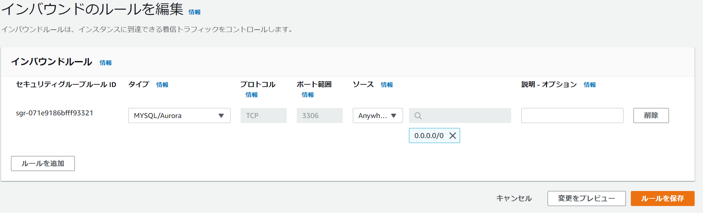

# RDS

ログのエクスポートは基本的に使用した方がよい cloudWatch ログに排出される

## 監査ログ

AWS 専用のログ

## エラーログ

## 全般ログ

## スロークエリログ

IAMロールは、CloudWatchを保存するためのもの、自動に付与される

# メンテナンス

## マイナーバージョン自動アップグレードの有効化

## メンテナンスウィンドウ

セキュリティなどのアップデート、選択ウィンドウを使用

## 削除保護の有効化

中長期使用するDBには、チェックを付ける

RDSの作成は2、30分かかる

## データベース
### S3からの復元
ユーザーが指定してs3にスナップショットを保持して復元する機能が追加された。

## セキュリティグループ
インバウンドルールのソースが特定のIPアドレスになっている場合、0.0.0.0に修正する必要がある。


## プロキシ
lambdaを使用してRDSに接続する際に使用

##　リザーブドDBインスタンスを購入
中長期用、最大72%割引が可能
All Upfront = 前払い

## オプショングループ
追加の機能を付与する

## カスタムエンジンバージョン
RDSの内部のOSにアクセスして、変更したDBを作成できる。現在、OraclとSQL Serverのみ可能

## イベントサブスクリプション
イベントごとにEメールトピックを通知することができる

## レコメンデーション
推奨事項が出てくる

## 証明書の更新
発行切れの場合、HTTPSの証明書を更新する

# コマンド
EC2にmysqlの操作権限をインストール  
```
yum install mysql -y
```

アクセスするコマンド
mysql -h エンドポイント -u ユーザーネーム -p 

# DynamoDB Streams

## データの保存
過去24時間以内のデータ変更の履歴を保存し、24時間を経過すると消去される
データ容量はマネージド型で自動的に管理

## データ保存の順番
操作が実施された順番に応じてデータはシリアライズされる  
とｋ雨堤のハッシュキーに基づいた変更は正しい順番で保存されるが、ハッシュｋ－が異なる場合は受信した順番が前後される可能性がある

## クロスリージョンレプリケーション
ストリームによるキャプションをトリガーとしてクロスリージョンレプリケーションを実施することが可能  
## データ処理をトリガーとしてアプリケーション機能

## DAX
DAXはDynamDBにインメモリキャッシュ型の機能を付加する  
- ミリ秒単位からマイクロ病単位で結果整合性のある読込ワークロードの応答時間を短縮。マルチAZDAXクラスターは、１秒間に数百万件のリクエストを処理できる

## グローバルテーブル
DynamoDBの西濃のまま、世界中でフック数のリージョンにエンドポイントを持つことができる
読み書きのキャパシティに加えて、クロスリージョンレプリケーションのデータ転送料金に課金される

## オンデマンドバックアップ
パフォーマンスに影響なく数百TBのバックアップを実行可能
任意のタイミングで利用可能な長期間データ保存用バックアップ
従来はデータパイプラインを利用して取得したバックアップを用意に実施できるようになった。

## Read/Writeキャパシティオンデマンド
キャパシティ設定扶養でリクエストに応じた課金設定を選択できるようになった。
トラフィック量の予測が困難な場合にリクエストの実施数に応じて課金
オンデマンドでRead/Write処理に自動スケーリングを実施
プロビジョンドキャパシティ設定への変更は無制限
オンデマンドへの変更は1日1回まで

## DynamoDB活用のコツ
既存のRDB中心のアーキテクチャを見直してDynamoDBとLambdaなどの組み合わせでサービスが実健出来ないか検証する


